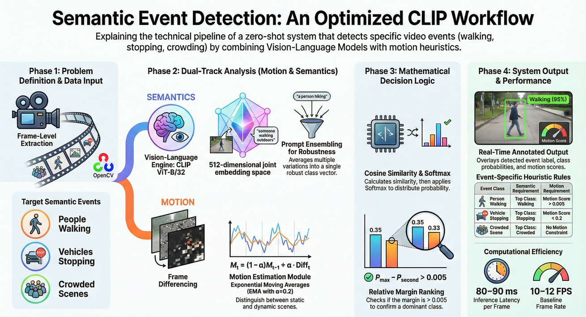

# Semantic Event Detection with Optimized CLIP

**A real-time, zero-shot video event detection system using OpenAI's CLIP and quantized PyTorch.**

This project implements a robust pipeline for detecting semantic events (**"Person Walking"**, **"Vehicle Stopping"**, **"Crowded Scene"**) in video streams. By combining **CLIP's semantic understanding** with **temporal motion heuristics**, it distinguishes between static objects (e.g., parked cars) and active events (e.g., stopping vehicles).

**Key Features:**
*   🚀 **Zero-Shot & Robust**: Uses **Prompt Ensembling** (averaging embeddings of "hiking", "walking", etc.) to detect events in diverse environments without retraining.
*   🧠 **Scientific Logic**: Replaces brittle thresholds with **Relative Margin Decision** logic for stable detections.
*   ⚡ **Efficient**: Dynamic Quantization (INT8) reduces model size by **2.5x** and boosts CPU inference speed by **1.27x**.

## 📊 System Workflow


##  Quick Start

### 1. Install Dependencies
```bash
pip install -r requirements.txt
```

### 2. Run Event Detection
**On a Single Video:**
```bash
python3 detect_events.py --video input/CAR_STOP.mp4 --output_dir results
```

**On a Directory (Batch Processing):**
```bash
python3 detect_events.py --input_dir input --output_dir results
```

The output videos with large red event overlays and debug stats will be saved in `results/`.

### 3. Optimize Model (Optional)
To generate the quantized INT8 model for faster CPU inference:
```bash
python3 optimize_model.py
```

---

## 📂 Project Structure
```
semantic_event_detection/
├── detect_events.py       # Main detection pipeline script
├── optimize_model.py      # Script to quantize CLIP (FP32 -> INT8)
├── generate_dummy_video.py # Helper to create test footage
├── requirements.txt       # Python dependencies
├── README.md              # This file
├── report.md              # Performance report & methodology
├── models/                # Saved models (clip_fp32.pth, clip_int8.pth)
└── results/               # Output videos and logs
```

## 📄 Documentation
Detailed documentation on the system architecture and design decisions can be found in the `docs/` folder (or provided separately):
*   **[Workflow Documentation](workflow_documentation.md)**: Flowcharts of the logic.
*   **[Technical Deep Dive](technical_details.md)**: Explanation of Motion Detection & Prompt Ensembling.
*   **[Issue Resolution Log](issue_resolution_log.md)**: Solutions to specific challenges like CLIP probability flatness.

##  Features
*   **Hybrid Logic**: Combines Semantic Understanding (CLIP) + Temporal Motion (OpenCV).
*   **Prompt Ensembling**: Uses averaged embeddings (e.g., "hiking" + "walking") for robust detection.
*   **Relative Margin Decision**: Uses a scientific ranking approach (`Margin > 0.005`) instead of brittle absolute thresholds.
*   **Optimization**: Quantized model runs **1.27x faster** and is **2.57x smaller**.

## 📥 Models & Data

Due to file size limits, the trained models (`.pth` files) and large test videos are not included in this repository.

**Available upon request.**
Please contact the author for access to:
*   `models/clip_fp32.pth`
*   `models/clip_int8.pth`
